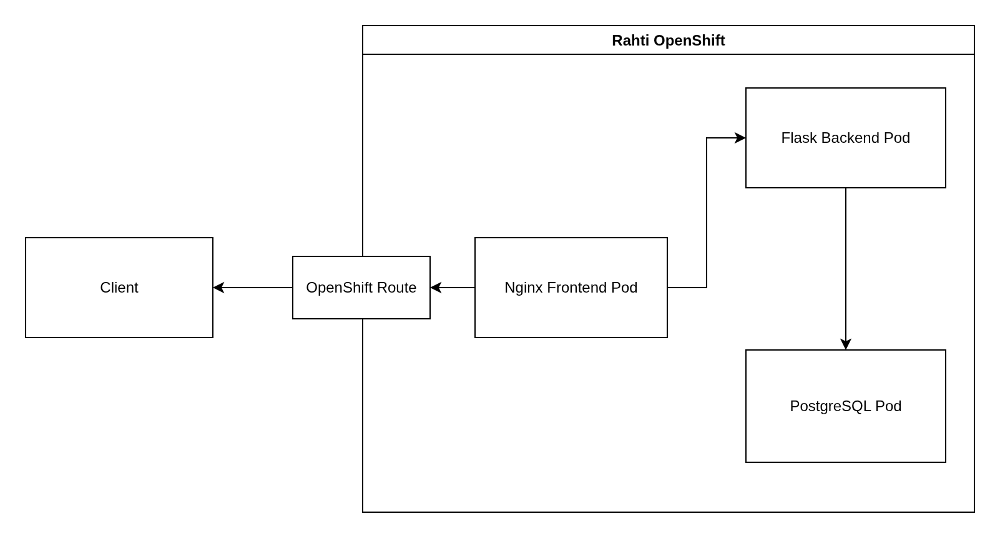

# Software architecture

## Table of Contents

* [Deployment diagram](#deployment-diagram)
* [CI/CD pipeline diagram](#cicd-pipeline-diagram)

## Deployment diagram

This project is designed to be deployed to OpenShift OKD distribution of Kubernetes. The manifests for the deployments, services, image streams, and routes are included in the [manifests](../manifests/) folder. The pods use image streams and triggers to update themselves when the target image is updated.

### OpenShift Route
The OpenShift Route node is a route in OpenShift OKD, that exposes the Nginx Frontend Pod's service to external traffic.

### Nginx Frontend Pod
The Nginx Frontend Pod functions as a reverse proxy and a static file server for the Vite + React frontend of the project. 

### Flask Backend Pod
The Flask Backend Pod contains all the backend logic of the project, implemented as a WSGI server using Gunicorn and Flask.

### PostgreSQL Pod
The PostgreSQL Pod is implemented with OKD's (or CSC's Rahti's) default PostgreSQL template with persistent storage.

## CI/CD pipeline diagram

The CI/CD pipeline of the project consists of three main steps.

1. Running tests and building and pushing Docker images to an image registry once code is pushed to the `main` branch.
2. Storing of the Docker images on a registry (by default Docker Hub).
3. Updating the deployment on OpenShift OKD via image streams and triggers.